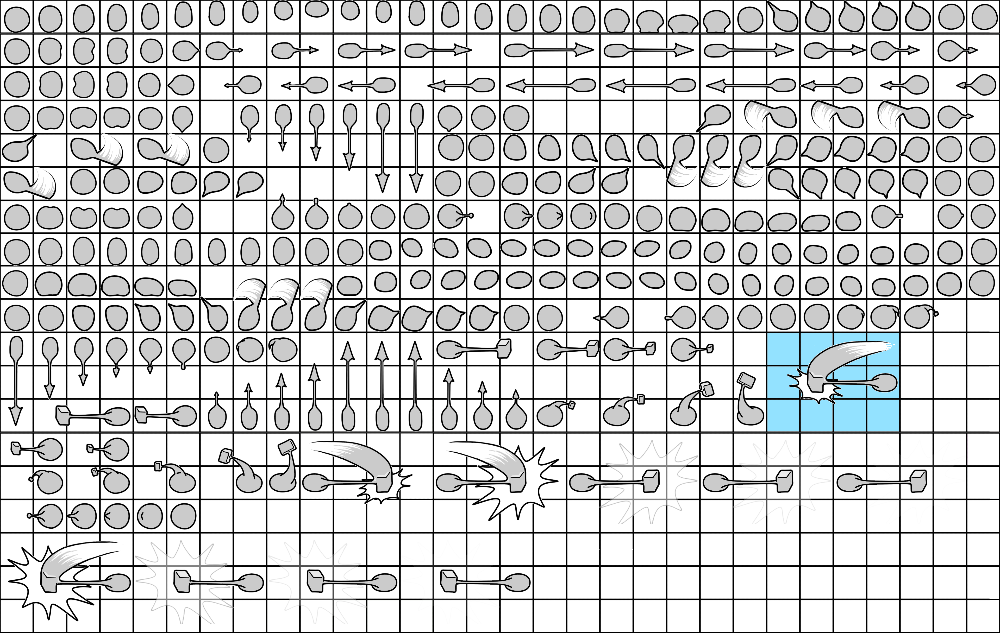
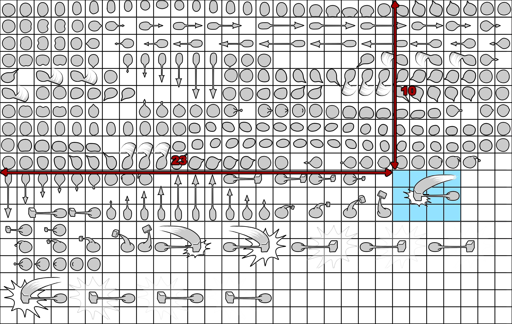

# Aster

## Setting up
### Mac
git clone --recursive https://github.com/amuoz/Aster.git
Install https://cmake.org/download/
`brew install cmake`
`mkdir Build`
`cd Build`
`cmake -G "Xcode" ..`
Double click in `Aster/Build/Aster.xcodeproj`
Inside Xcode:
  `Product`	>	`Scheme`	>	`Edit	Scheme` > `Run` > `Executable` > `Aster`
Press play (upper left corner)
### Windows
git clone --recursive https://github.com/amuoz/Aster.git
Install https://cmake.org/download/
`mkdir Build`
`cd Build`
`cmake -G "Visual Studio 19" "Win64" ..`
Double click in `Aster/Build/Aster.sln`
Inside Visual Studio:
`Aster` > Set as startup project

## Actor
Base class for all the entities in the game (blocks, enemies, player, power ups, ..).

When crafting a new entity you should override ONLY WHEN NECESSARY the following methods:

**BeginPlay**: First piece of code executed after construction.
**Update**: Tick logic.
**Destroy**: Free up resources and execute code before garbage collection.
**Draw**: Rendering. Override only if special rendering.
**TakeDamage**: What to do when entity takes damage.
**Move**: Override only if moving entity.
**OnBeginOverlapFunction**: Start collision with other collider.
**OnEndOverlapFunction**: End collision with other collider.

Unreal engine actor lifecycle:
https://docs.unrealengine.com/en-US/ProgrammingAndScripting/ProgrammingWithCPP/UnrealArchitecture/Actors/ActorLifecycle/index.html

## Level
Level descriptor defined in **one.json** inside Levels folder.

**LevelInfo** variable holds all the level information.

Add new types of entities in the level: push it into **Actors** level variable. This is done in **Level::Load** method.

## Game
Main class.

**Asset** loading in **Game::InitGame** (.png, .json, shaders, .ttf, ..)

**State** variable tells game current state (Game Active, Game Over).

## Player Controller
User **input** and user **interface**.

**Posses** takes control of player actor in runtime.

## Physics engine

Add collisions to an entity calling **AddDynamicActor** from constructor. This will create a **PhysicActor** which is the representation of the entity in the physics engine. 

Enable **bCheckCollision** for the physics engine to check for collisions (default disabled)

### Collision types

A PhysicActor always has a collision channel. Change collision response to shape the behaviour of the entity.

**CollisionChannels**: DYNAMIC, STATIC, PLAYER

**CollisionResponses**: IGNORED, OVERLAP, BLOCK

### Built-in base collision

Actor parent class comes with a built-in base collision **ActorCollider**. 

Override **OnBeginOverlapFunction** and **OnEndOverlapFunction** for gameplay logic.

### Multiple collisions

An entity can have multiple collisions (PhysicActor). Check **SpikeEnemy** for an example.

## Animation
Draws a piece of a texture that change over time

### .anim files
Each row represents a frame of the animation. The format of the rows is:
`Sx Sy Sw Sh Ax Ay`
* **Sx, Sy**: Coordinates of the upper-left corner of the sprite inside the spritesheet (in number of cells)
* **Sw, Sh**: Width and Height of the sprite (in number of cells)
* **Ax, Ay**: Coordinates of the actor inside of the sprite (in number of cells)

For example, for the sprite marked in blue in the player spritesheet:
 
 
The row for the frame would be:
`23 10 4 3 3 1`